# recall - code snippet tracker

## Introduction
This is a simple application for tracking small snippets of code in an organized way so that they can be found easily later, for instance when programming.

## How to Use

### Locally
Install dependencies (```pip install -r requirements.txt```), then start the app with ```python3 manage.py runserver```.

### Server
Set some environment variables: ```DJANGO_DEBUG``` to ```False```, ```DJANGO_SECRET_KEY``` to something secure.  You might also need to modify ```ALLOWED_HOSTS``` (```recall/settings.py```) depending on what kind of host you use.


## Screenshots
### Welcome Page
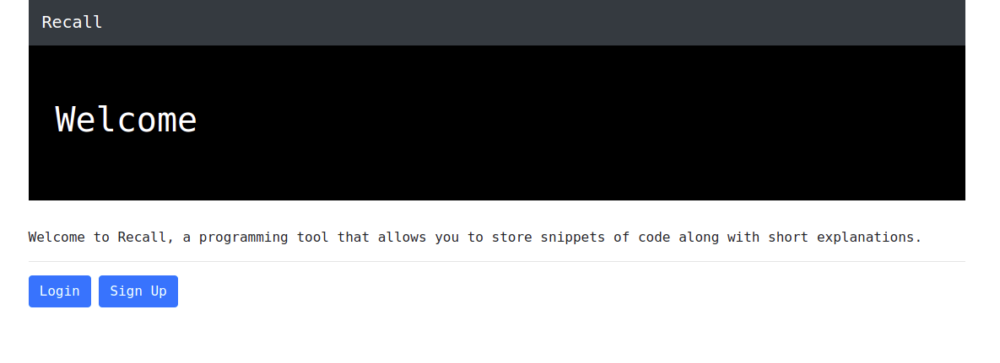

### Main Page
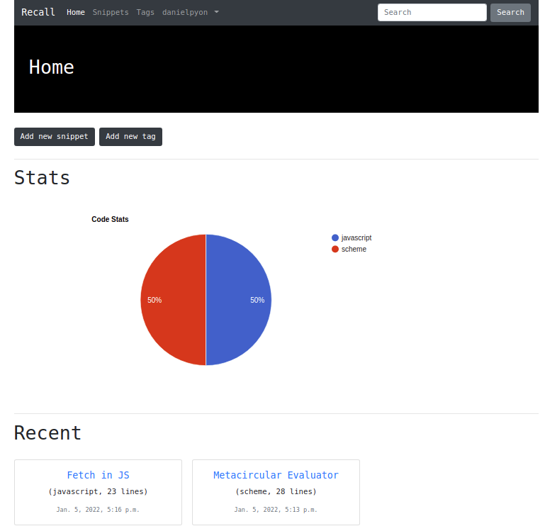

### Add Snippets
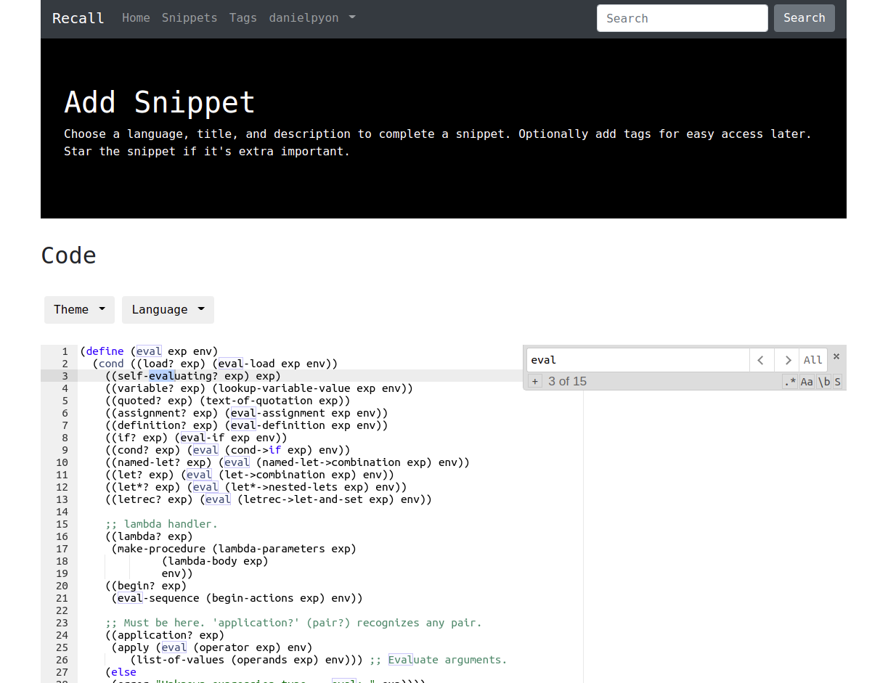

---

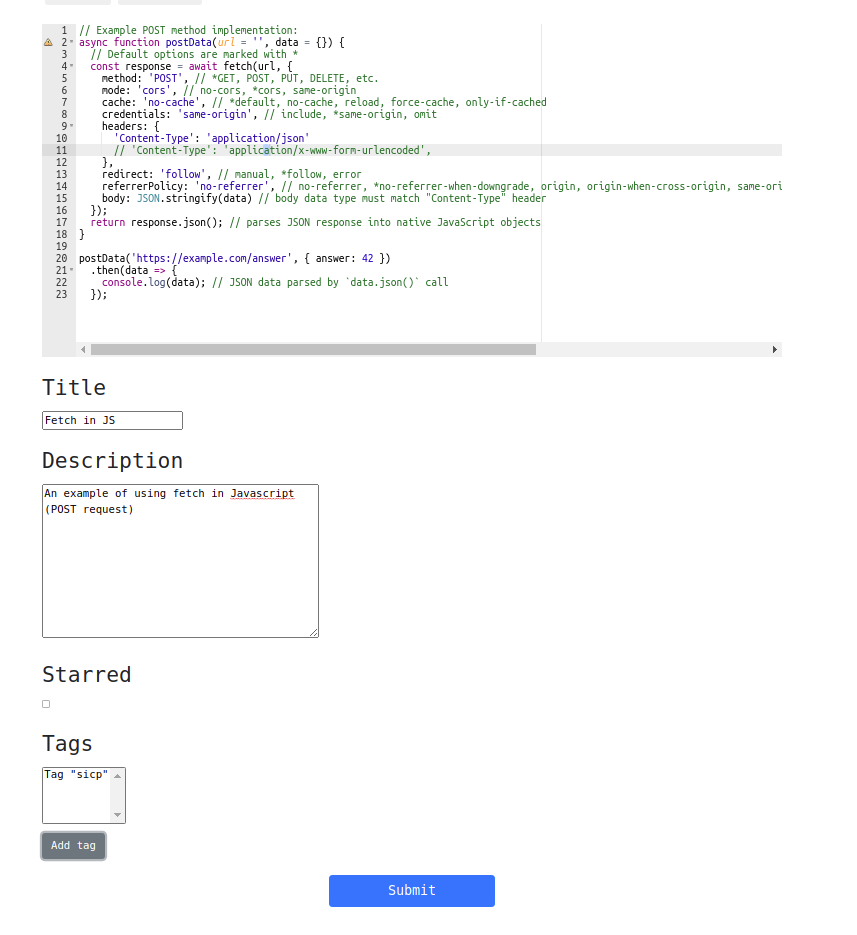


### View Snippets
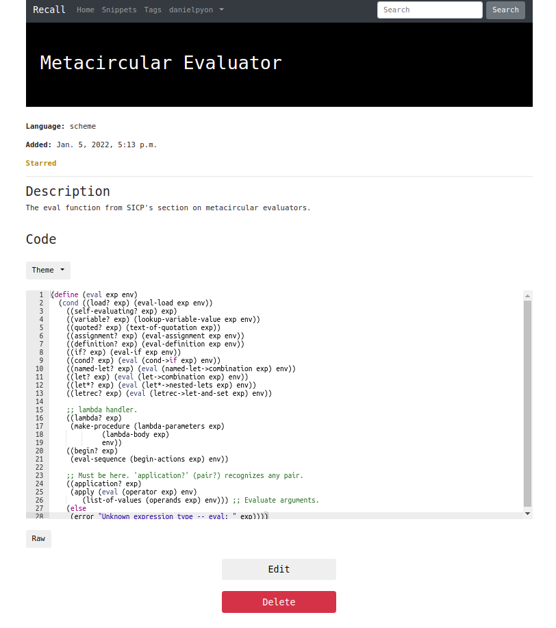

### Search for Snippets
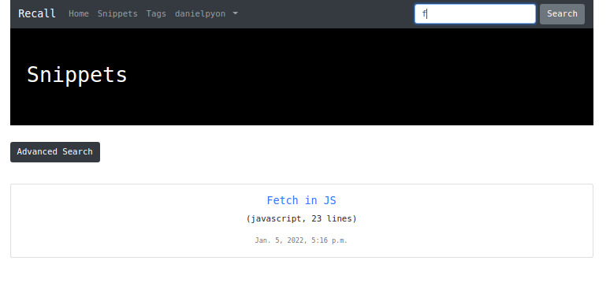

---

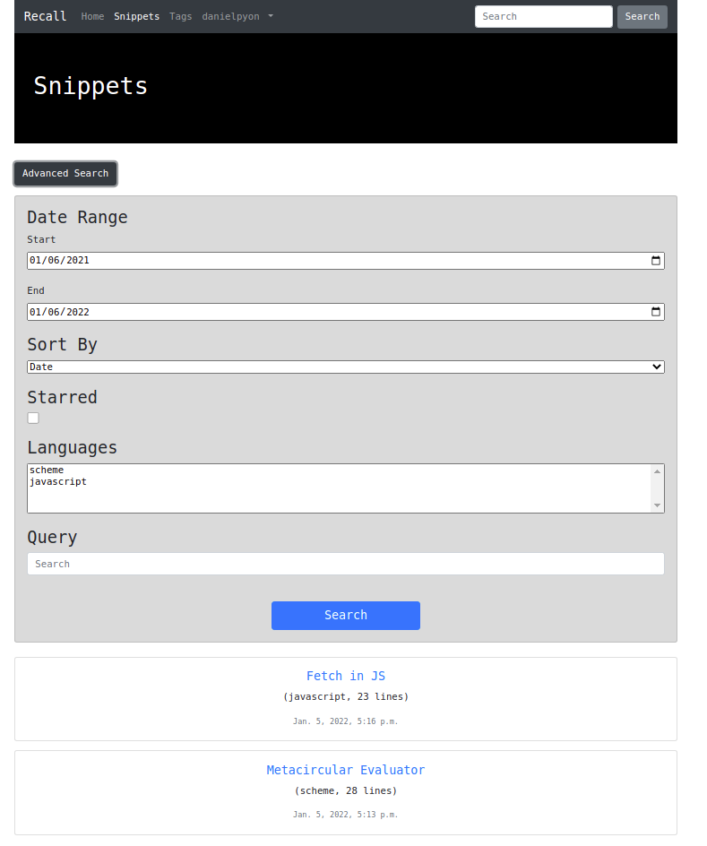

### Organize Snippets with Tags
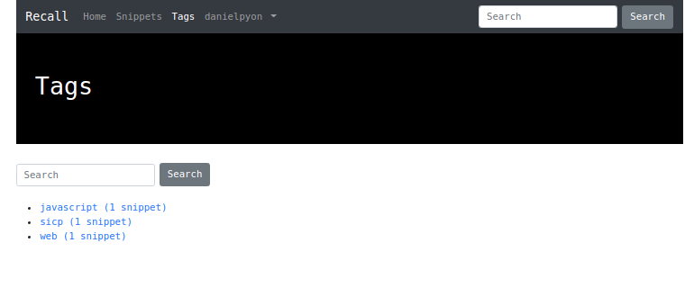

### Edit Snippets
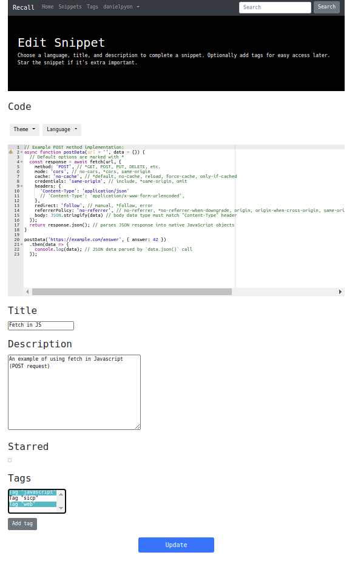
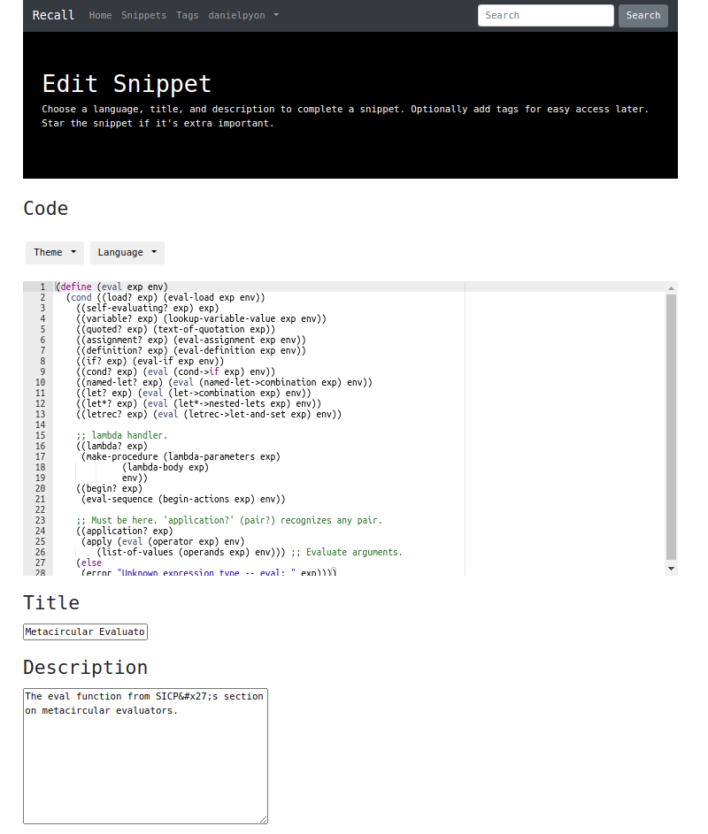

### Account Settings
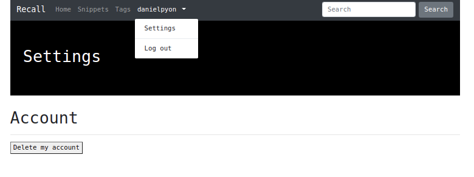

